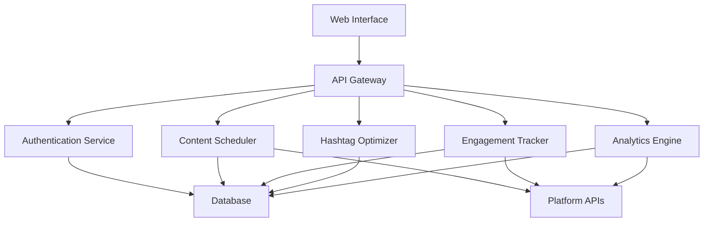

# Social Media Automation System Architecture

## System Components

## API Endpoints

### Authentication
- `POST /auth/login` - User authentication
- `POST /auth/refresh` - Refresh access token
- `POST /auth/logout` - Invalidate tokens

### Accounts
- `GET /accounts` - List connected social accounts
- `POST /accounts` - Connect new social account
- `DELETE /accounts/{id}` - Disconnect account

### Content
- `GET /content` - List scheduled posts
- `POST /content` - Schedule new post
- `PUT /content/{id}` - Update scheduled post
- `DELETE /content/{id}` - Cancel scheduled post

### Analytics
- `GET /analytics/{account_id}` - Get account analytics
- `GET /analytics/{account_id}/posts` - Get post performance
- `GET /analytics/hashtags` - Get hashtag performance

### Hashtags
- `GET /hashtags/suggestions` - Get hashtag suggestions
- `POST /hashtags/analyze` - Analyze hashtag performance
- `GET /hashtags/trending` - Get trending hashtags